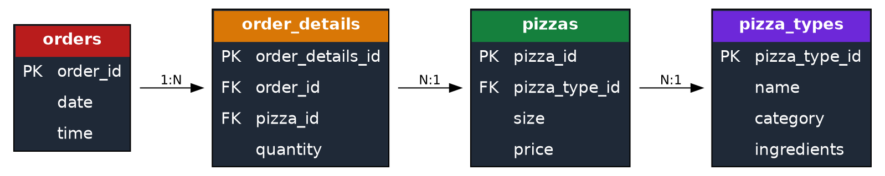
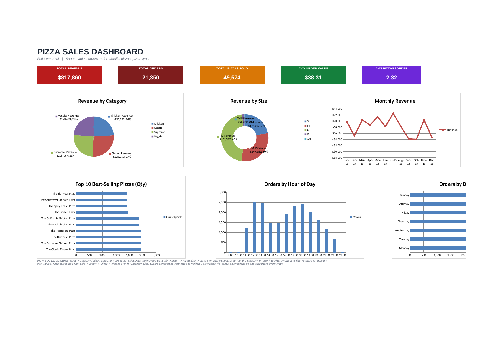

# Pizza Sales Analysis

## Overview

This project analyzes a full year (2015) of pizza sales data — 21,350 orders and 48,620 order line items across 91 pizza SKUs — using SQL for analysis and Excel for interactive reporting. It answers core business questions around revenue, product performance, and order timing, and packages the results into a KPI dashboard.

## Project Objective

Analyze one year of pizza sales data using SQL and Excel to identify revenue trends, customer purchasing behavior, best-selling products, and peak ordering periods. The insights support business decisions related to inventory planning, menu optimization, and sales performance.


## Dataset

Four relational tables, joined on `order_id` and `pizza_id` / `pizza_type_id`:

| Table           | Rows   | Description                                  |
| --------------- | ------ | -------------------------------------------- |
| `orders`        | 21,350 | order_id, date, time                         |
| `order_details` | 48,620 | line items — order_id, pizza_id, quantity    |
| `pizzas`        | 96     | pizza_id, pizza_type_id, size, price          |
| `pizza_types`   | 32     | pizza_type_id, name, category, ingredients   |



## Tools Used

- SQLite (query development & validation)
- SQL (joins, aggregates, window functions)
- Microsoft Excel (formulas, PivotTables, charts, dashboard)

## How to Run

1. Clone the repo.
2. Load the four CSVs in `data/` into a SQLite database (e.g. `sqlite3 pizza.db` then `.import` each file, or open them directly with the SQLite CLI/DB Browser for SQLite).
3. Run the queries in `sql/PizzaSales.sql` in order — they're grouped into KPIs, Product Analysis, Time Analysis, and Customer/Order Insights.
4. Query outputs are pre-exported as CSVs in `results/` if you just want to inspect results without re-running anything.
5. Open `dashboard/Pizza Dashboard.xlsx` to see the KPI cards, charts, and PivotTable-ready raw data table.

## KPIs

| Metric                              | Value       |
| ------------------------------------ | ----------- |
| Total Revenue                        | $817,860.05 |
| Total Orders                         | 21,350      |
| Total Pizzas Sold (sum of `quantity`)| 49,574      |
| Average Order Value                  | $38.31      |
| Average Pizzas per Order             | 2.32        |

> Note: "Total Pizzas Sold" (49,574) is the sum of the `quantity` column across all 48,620 order-detail line items — some line items order more than one of the same pizza, which is why this number is higher than the row count.

## Dashboard



The Excel dashboard (`dashboard/Pizza Dashboard.xlsx`) includes:

- 5 KPI cards (Total Revenue, Total Orders, Total Pizzas Sold, Avg Order Value, Avg Pizzas/Order) — all formula-driven off the raw data, not hardcoded
- Revenue by Category (Pie), Revenue by Size (Doughnut), Monthly Revenue (Line), Top 10 Pizzas (Horizontal Bar), Orders by Hour (Column), Orders by Day (Bar)
- A raw `SalesData` Excel Table (48,620 rows) ready for PivotTables and slicers on Month, Category, and Size

## Key Insights

- **Classic** pizzas sold the most units (14,888) and generated the highest revenue ($220,053), while **Chicken** pizzas had the highest revenue per pizza sold despite the fewest units moved.
- **Large (L)** pizzas drove the most revenue ($375,319 — 46% of total), while **The Thai Chicken Pizza** was the top earner within the Chicken category ($43,434).
- Orders peak at **lunch (12–1 PM)** and again at **dinner (5–7 PM)**, with very little volume before 11 AM or after 10 PM.
- **Friday** is the busiest day of the week (3,538 orders); **Sunday** is the quietest (2,624 orders).
- - **Weekdays** contributed 73% of total revenue ($595,474), while weekends contributed 27% ($222,386).

## Project Structure

```
Pizza-Chain-Sales-Analysis-/
├── data/                  Raw source CSVs (orders, order_details, pizzas, pizza_types)
├── sql/PizzaSales.sql     20 SQL queries: KPIs, product, time & revenue analysis
├── results/               CSV export of every query's output
├── dashboard/             Pizza Dashboard.xlsx — KPI cards, charts, raw data table
├── screenshots/           schema.png, sql1.png, dashboard.png
├── LICENSE
└── README.md
```

## Skills Demonstrated

- SQL JOINs across a 4-table relational schema
- Aggregate functions (SUM, COUNT, AVG) and window functions (RANK)
- KPI reporting and percentage-of-total analysis
- Excel formulas (SUMIFS) driving live KPI cards and charts from raw data
- Dashboard design: KPI cards, chart selection, PivotTable/slicer-ready data

## Business Value

This analysis enables business stakeholders to:

- Identify top-performing and underperforming pizza categories.
- Understand customer ordering patterns across different days and hours.
- Evaluate revenue contribution by pizza size and category.
- Support pricing, inventory planning, staffing, and promotional decisions using data-driven insights.

## License

This project is licensed under the MIT License — see [LICENSE](LICENSE) for details.
